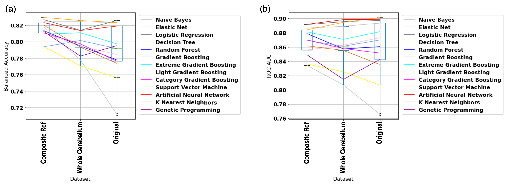
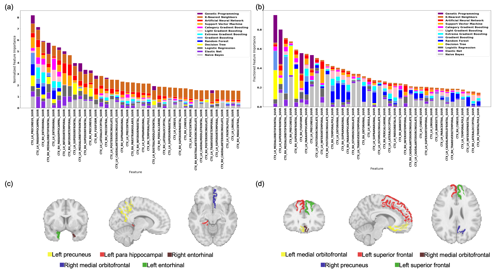
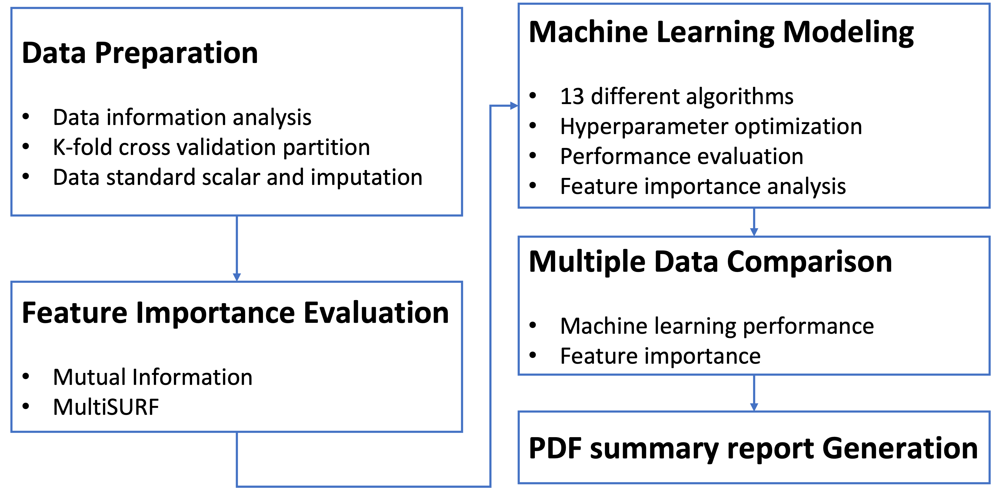

# Comparing Amyloid Imaging Normalization Strategies for Alzheimer's Disease Classification using an Automated Machine Learning Pipeline

Boning Tong<sup>1</sup>, Shannon L. Risacher<sup>2</sup>, Jingxuan Bao<sup>1</sup>, Yanbo Feng<sup>1</sup>, Xinkai Wang<sup>1</sup>, Marylyn Ritchie<sup>1</sup>, Jason Moore<sup>3</sup>, Ryan Urbanowicz<sup>3</sup>, Andrew J. Saykin<sup>2</sup>, Li Shen<sup>1</sup>

<sup>1</sup>University of Pennsylvania, Philadelphia, PA, USA

<sup>2</sup>Indiana University, Indianapolis, IN

<sup>3</sup>Cedars-Sinai Medical Center, West Hollywood, CA 


This repository holds the official code for the [paper](https://pubmed.ncbi.nlm.nih.gov/37350880/) (Accepted by [AMIA IS 2023](https://amia.org/education-events/amia-2023-informatics-summit))  





### Abstract
Amyloid imaging has been widely used in Alzheimer’s disease (AD) diagnosis and biomarker discovery through detecting the regional amyloid plaque density. It is essential to be normalized by a reference region to reduce noise and artifacts. To explore an optimal normalization strategy, we employ an automated machine learning (AutoML) pipeline, STREAMLINE, to conduct the AD diagnosis binary classification and perform permutation-based feature importance analysis with thirteen machine learning models. In this work, we perform a comparative study to evaluate the prediction performance and biomarker discovery capability of three amyloid imaging measures, including one original measure and two normalized measures using two reference regions (i.e., the whole cerebellum and the composite reference region). Our AutoML results indicate that the composite reference region normalization dataset yields a higher balanced accuracy, and identifies more AD-related regions based on the fractioned feature importance ranking.

### Method
We mainly used the STREAMLINE pipeline for the analysis, see https://github.com/UrbsLab/STREAMLINE. We updated the "Fractioned Feature Importance" option for the FI recalling method and reported the top contributed features based on the FI values. Balanced accuracy, ROC AUC scores, and most figures are generated directly by the STREAMLINE, and a supplementary code for other plots are provided in `AMIAIS_23_data_post_processing_plot.ipynb`.



### Data
We used the amyloid PET imaging data (AV45) downloaded from Alzheimer's Disease Neuroimaging Initiative (ADNI) database, which needs credentials (see https://adni.loni.usc.edu/).
Participants (N=809) included 486 cognitively normal (CN) and 323 AD subjects. In this study, we focus on examining amyloid measures in 68 FreeSurfer cortical regions. We normalize each regional cortical measure using two reference regions, respectively, where the normalized measure is defined by the original measure divided by the measure in the reference region. The two reference regions are the whole cerebellum and composite regions


### Acknowledgements
This work was supported in part by the National Institutes of Health [U01 AG066833, U01 AG068057, R01 AG071470]. Data used in this study were obtained from the Alzheimer's Disease Neuroimaging Initiative database, which was funded by NIH U01 AG024904.


### Maintainers

Boning Tong: [boningt@seas.upenn.edu](mailto:boningt@seas.upenn.edu)


### Citation

```
@article{tong2023comparing,
  title={Comparing Amyloid Imaging Normalization Strategies for Alzheimer’s Disease Classification using an Automated Machine Learning Pipeline},
  author={Tong, Boning and Risacher, Shannon L and Bao, Jingxuan and Feng, Yanbo and Wang, Xinkai and Ritchie, Marylyn D and Moore, Jason H and Urbanowicz, Ryan and Saykin, Andrew J and Shen, Li},
  journal={AMIA Summits on Translational Science Proceedings},
  volume={2023},
  pages={525},
  year={2023},
  publisher={American Medical Informatics Association}
}
```


   
