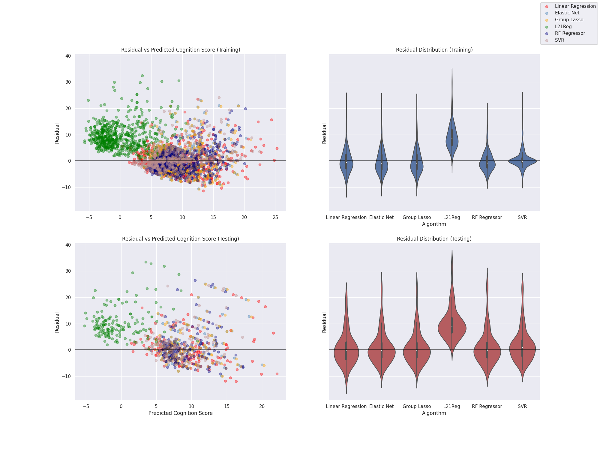

# Regression Simple Transparent End-to-End Automated Machine Learning Pipeline (STREAMLINE)
This Reg_STREAMLINE directory in the STREAMLINE-CB4AD repository holds the official code for the 
conference paper [Exploring Automated Machine Learning for Cognitive Outcome Prediction
from Multimodal Brain Imaging using STREAMLINE](https://pubmed.ncbi.nlm.nih.gov/37350896/) 
(Accepted by [AMIA 2023]((https://amia.org/education-events/amia-2023-informatics-summit)))

## Abstract
STREAMLINE is a simple, transparent, end-to-end automated machine learning (AutoML) pipeline for 
easily conducting rigorous machine learning (ML) modeling and analysis. The initial version is 
limited to binary classification. To expand its functionality and versatility, in this work, 
we extend STREAMLINE through implementing multiple regression-based ML models, including linear 
regression, elastic net, random forest, support vector regressor, group lasso, L21 norm regularized 
linear regression, Adaptive Boosting, and Gradient Boosting. 
We demonstrate the effectiveness of the regression version of STREAMLINE by applying it to 
the prediction of Alzheimer’s disease (AD) cognitive outcomes using multimodal brain imaging 
data. Our empirical results demonstrate the feasibility and effectiveness of the newly expanded 
STREAMLINE as an AutoML pipeline for evaluating AD regression models, and for discovering multimodal 
imaging biomarkers.

## Method

This figure demonstrates the workflow of our Regression STREAMLINE pipeline. The pipeline is modified based on the original STREAMLINE: [https://github.com/UrbsLab/STREAMLINE](https://github.com/UrbsLab/STREAMLINE). We replaced the binary classification ML algorithms by the regression ML algorithms by adding new regression models, modifying pipeline structure, and using new evaluation metrics, such as MSE and explained variance, and visualizations, such as actual vs. prediction plots, residual distribution plots, and probability plots. Some example visualizations are shown below:

 

## Data
Data used in this work are obtained from the Alzheimer’s Disease Neuroimaging Initiative (ADNI) database ([adni.loni.usc.edu](adni.loni.usc.edu)). ADNI was launched in 2003 as a public-private partnership, led by Principal Investigator Michael W. Weiner, MD. The primary goal of ADNI has been to test whether serial magnetic resonance imaging (MRI), positron emission tomography (PET), other biological markers, and clinical and neuropsychological assessment can be combined to measure the progression of mild cognitive impairment (MCI) and early AD. For up-to-date information, see [www.adni-info.org](www.adni-info.org).

In this work, we extracted and analyzed 805 non-Hispanic Caucasian subjects with complete baseline measurements (the first session of diagnosis, or session M-00) of imaging modalities, genotype data, and visit-matched diagnostic information from the ADNI dataset. This representative sample is composed of 274 controls (i.e. 196 healthy controls (HC) and 78 significant memory concern (SMC) controls) and 531 cases (i.e. 235 early mild cognitive impairment (EMCI) patients, 162 late mild cognitive impairment (LMCI) patients, and 134 AD patients). Among the available types of data provided by the sample, this work focused on the imaging modality data specifically, which include three different imaging modalities: structural MRI (sMRI, measuring brain morphometry), amyloid-PET (AV45-PET, measuring amyloid burden), and FDG-PET (measuring  glucose metabolism). 

## Acknowledgements
This work was supported in part by the National Institutes of Health [U01 AG066833, U01 AG068057, R01 AG071470]. Data used in this study were obtained from the Alzheimer's Disease Neuroimaging Initiative database, which was funded by NIH U01 AG024904.

## Maintainers
Yanbo Feng: [yanbof@seas.upenn.edu](yanbof@seas.upenn.edu)

## Citation

